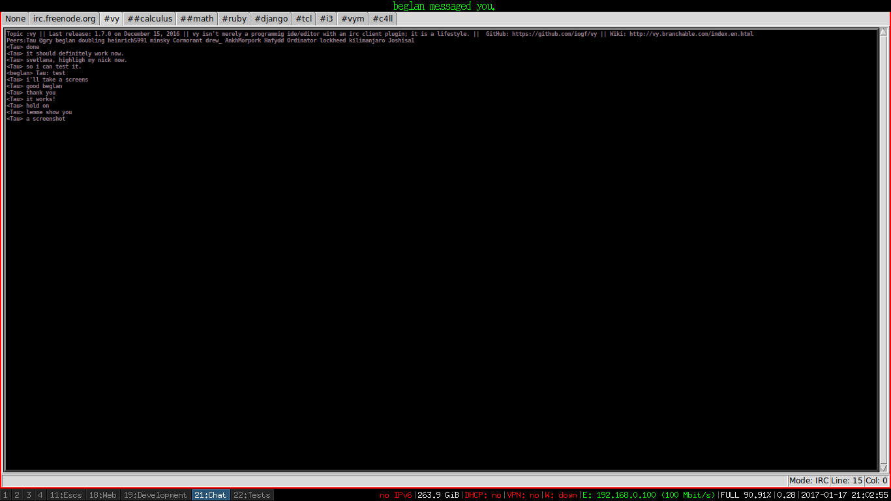

# whocall
A simple extension for vy irc plugin a.k.a vyirc to display a dzen2 text message when someone calls you.

# Usage

In your vyrc file, just install the plugin to the irc object that is an IrcMode class.
It is enough to have notification of when someone mentions your nick.

~~~pythonn
from vyapp.plugins.vyirc import IrcMode
from whocall import WhoCall
# Here, the network connections can be defined. 
def irc_freenode(addr='irc.freenode.org', port=6667, user='vy vy vy :vyirc', nick='vyirc', 
             irccmd='PRIVMSG nickserv :identify nick_password', channels=['#vy']):

    irc = IrcMode(addr, port, user, nick, irccmd, channels)
    WhoCall(irc)
~~~

